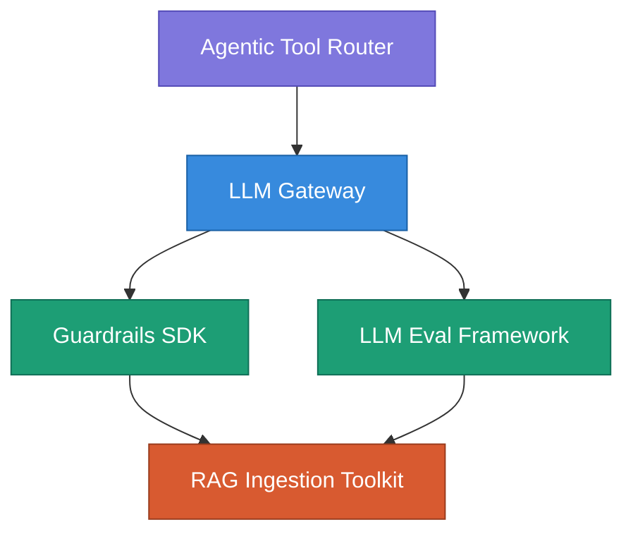

# LLM Infrastructure

A modular stack for building reliable LLM-powered applications - from raw data ingestion to autonomous agents.

Each project is an independent, production-style component. Together they form a complete AI application architecture.

## Architecture

> **Application** → Agentic Tool Router · **Infrastructure** → LLM Gateway · **Quality** → Guardrails SDK + LLM Eval Framework · **Data** → RAG Ingestion Toolkit

## Projects

### [Agentic Tool Router](https://github.com/vola-trebla/agentic-tool-router) - Application Layer

ReAct-style AI agent that answers space questions by autonomously selecting and calling real-time NASA APIs.

**Key concepts:** ReAct loop (think → act → observe), function calling, tool registry, multi-step reasoning trace

**Stack:** TypeScript · Gemini 2.5 Flash · Hono · Zod

---

### [LLM Gateway](https://github.com/vola-trebla/llm-gateway) - Infrastructure Layer

A proxy server between your application and LLM providers. Single entry point for all AI requests with built-in reliability and cost control.

**Key concepts:** Multi-provider routing, automatic fallback, circuit breaker pattern, cost metering, rate limiting

**Stack:** TypeScript · Express · Anthropic SDK · Gemini SDK

---

### [Guardrails SDK](https://github.com/vola-trebla/guardrails-sdk) - Quality Layer

An npm library for guaranteed valid, typed output from LLMs. Write `generate(schema, prompt)` and get a typed object that is guaranteed to pass validation.

**Key concepts:** Schema-driven validation, automatic retry with self-correction prompts, provider-agnostic design

**Stack:** TypeScript · Zod · Anthropic SDK · Gemini SDK

---

### [LLM Eval Framework](https://github.com/vola-trebla/llm-eval-framework) - Quality Layer

A framework for testing LLM output quality. Think pytest, but for prompts.

**Key concepts:** Dataset-driven evaluation, custom metrics and assertions, regression detection, structured reporting

**Stack:** Python · Anthropic SDK · pytest-style assertions

---

### [RAG Ingestion Toolkit](https://github.com/vola-trebla/rag-ingestion-toolkit) - Data Layer

Clean, structured data pipeline for RAG systems. Converts raw HTML, PDF, and Markdown into chunked, embedding-ready output with metadata extraction.

**Key concepts:** Format-specific parsing, semantic chunking, metadata extraction, pipeline orchestration

**Stack:** Python · BeautifulSoup4 · pdfplumber

---

## Design Decisions

**Why separate projects, not a monorepo?** Each component is independently deployable and useful on its own. A guardrails library doesn't need to know about your gateway. This mirrors how infrastructure is built in production - small, focused tools composed together.

**Why both TypeScript and Python?** TypeScript for runtime services (gateway, agent, SDK) where type safety and npm distribution matter. Python for data processing and evaluation where the ML ecosystem lives. This reflects the real-world split in AI engineering teams.

**Why the layered architecture?** Each layer solves one problem and depends only on the layer below. Data layer has zero LLM dependencies. Quality layer validates but doesn't route. Infrastructure layer routes but doesn't decide. Application layer orchestrates everything. You can swap any layer without breaking the others.

**Why build from scratch instead of using LangChain / LlamaIndex?** Understanding the primitives. Every component here solves a problem I can explain in an interview - how circuit breakers prevent cascade failures, why schema validation needs retry loops, what makes a chunking strategy "smart." Frameworks hide these decisions. Building them teaches them.
